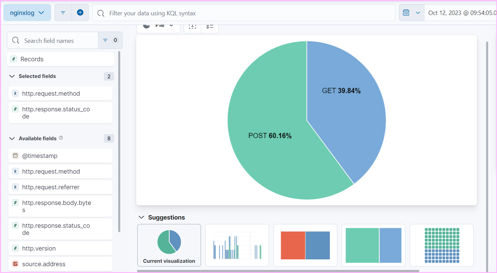
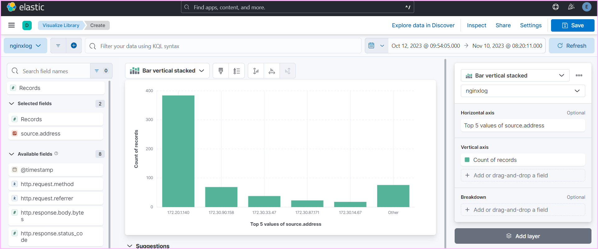
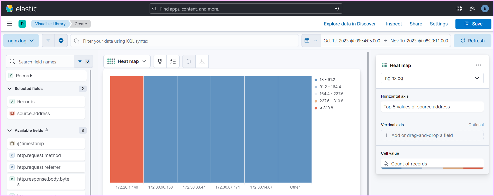
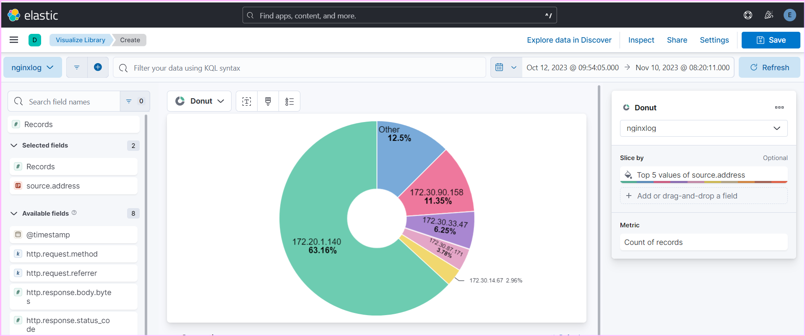
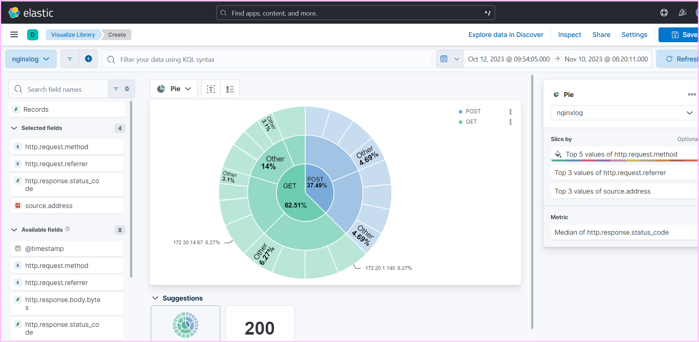

# Honeypot and Secure Web Environment Setup

### 1 Honeypots

A honeypot is a security mechanism designed to detect and monitor unauthorized access or attacks on a network or system. In this project, we will implement a honeypot (python script in honeypot/honeypot.py) to detect and analyze potential security threats. The honeypot will run on a custom port (12345) and record interaction attempts from potential attackers.

### 1.1  Here's how the code works:

- It imports the socket module, which is used to create a network socket and handle incoming connections.

- It defines the honeypot_port variable, specifying the port number on which the honeypot will listen for incoming connections.

- The start_honeypot function sets up the honeypot server using a  block for proper resource management. It binds the server socket to all available network interfaces on a specified port and starts listening for incoming connections.

- When a connection is established, it logs the IP address of the connecting client.

- The code logs the connection and login attempt details to a file named 'honeypot.log'  and responds to the client with a login failure message.

- The start_honeypot function continues to listen for new connections in an infinite loop.

### 1.2 Honeypot Usage

## Background Mode

To run the honeypot in the background, navigate to the honeypot directory and execute the following command:

  # python honeypot.py > honeypot.log 2>&1 &

## Live Mode

If you want to run the honeypot live, use the following command:

   # python custom_honeypot.py

### 2 Secure Web Environment

In addition to the honeypot, we will create a secure web environment with the following features:

- User authentication with secure login.
- User registration without email verification, captcha, or 2FA.
- User account management, including enabling/disabling users.
- Uploading avatars.
- A secure admin panel for user management.
- Extensive logging with Kibana integration for monitoring.
- Honeypot challenges for testing against common web vulnerabilities.

##  Step-by-Step Guide to Setup the Environment

Before you begin, make sure you have the following prerequisites in place:

## 2.1.1  A server with a suitable operating system (e.g.debien).

## 2.1.2 Nginx  installed and configured.
   
   -  Install the prerequisites:
      
       # sudo apt install curl gnupg2 ca-certificates lsb-release debian-archive-keyring
   
   -  Import an official nginx signing key so apt could verify the packages
    authenticity. Fetch the key:

       # curl https://nginx.org/keys/nginx_signing.key | gpg --dearmor |sudo tee /usr/share/keyrings nginx-archive-keyring.gpg >/dev/null
  
  - Verify that the downloaded file contains the proper key:
   
       # gpg --dry-run --quiet --no-keyring --import --import-optionsimport-show /usr/share/keyrings/nginx-archive-keyring.gpg

  - Set up the apt repository for stable nginx packages, run the following command:
    
       # echo "deb [signed-by=/usr/share/keyrings/nginx-archive-keyring.gpg]http://nginx.org/packages/debian `lsb_release` -cs' nginx" sudo tee /etc/apt/sources.list.d/nginx.list`

  - To install nginx, run the following commands:
       
       # sudo apt update
       # sudo apt upgrade
       # sudo apt install nginx

## 2.1.3 PHP 8.2 installed and configured.

  - Install the PHP package 
  
     # sudo apt install php8.2-fpm -y
  
  - Edit the site configuration in /etc/nginx/conf.d/default.conf .
  
     # Add index.php to the index list.
 
  - Add the PHP block
 
     location ~ \.php$ {
      fastcgi_pass unix:/run/php/php8.2-fpm.sock;
      fastcgi_param SCRIPT_FILENAME $document_root$fastcgi_script_name;
      include fastcgi_params;
    }

  - Add the nginx user to the www-data group.
   
    # usermod -aG www-data nginx

  - Restart nginx: 
    
    # sudo systemctl restart nginx
  
  - Create a new file in /usr/share/nginx/html/phpinfo.php and add the content.
      
    # <?php echo phpinfo();?>

## 2.1.3 mariadb intalled on the server

   # sudo apt install mariadb-server
  
  - run a security script
    
    # sudo mysql_secure_installation

## 2.1.4 Elasticsearch, Kibana, and filebeat set up for  logging.

### 2.2 Configuring Nginx

- Set up Nginx to serve your web application.

- Create server blocks or virtual hosts for your web application and configure them to use SSL (HTTPS).

- Ensure that your web application is accessible over HTTPS for secure communication.

### 2.3 Web Environment Setup

## 2.3.1 Implementing User Authentication and Registration

- Implement user authentication for secure login.

- Set up user registration without email verification, captcha, or 2FA.

## 2.3.2 User Account Management and Avatars

- Create an admin panel for user management, including the ability to enable/disable users.

- Allow users to upload avatars and handle them securely.

## 2.3.3 Kibana Integration for Logging
 
- Set up Elasticsearch, Kibana, and filebeat to collect and analyze logs.

- Configure log shipping from your web server and honeypot to Elasticsearch.

## 2.3.4 Honeypot Challenges

- Create honeypot challenges within your web environment to test for common web vulnerabilities like SQL injection SQL injection, Cross-Site Scripting (XSS), CSRF and Broken Access Control.

## 2.3.5 Honeypot Challenges solution

# CHALLENGE 1(SQL)
        when user inputs are directly inserted into SQL queries without proper sanitization.

#       SOLUTION
   - ' OR 1=1 --
   - ' UNION SELECT null, username, password FROM users --

# CHALLENGE 2(XSS)
   - Here,the PHP script takes a search query from the user through a GET parameter and displays the search results on the page. However, the script directly echoes the user's input without proper escaping or validation, making it vulnerable to XSS attacks.

#      SOLUTION
   - Add this 

# CHALLENGE 3(Broken Access Control)

#     SOLUTION

-  Changing the userid cookie to 1 solves the challenge

# CHALLENGE 4(CSRF)
      

#     SOLUTION
    
   - Attacker can create a simple HTML page with JavaScript to perform a CSRF attack . This script will automatically submit a form to transfer funds when the user visits the page.
   
   - lacks anti-CSRF protection. This makes it vulnerable to Cross-Site Request Forgery (CSRF) attacks. 

# CHALLENGE 5(XSS)
     
#    SOLUTION
  
  -  The attacker can access  by modifying the URL in the browser address bar.
   ?input=

### 2.4 Securing the Environment

- Implement 'server_tokens off' preventing NGINX from including the server version  information in the HTTP response headers

- Implement 'limit_except'  restricts all HTTP methods except for GET and POST, 

- Inplenevt the 'autoindex directive'NGINX won't automatically generate a directory listing. Instead, it will typically return a "403 Forbidden" error or whatever error page you have configured for such cases. 

- Implement 'The add_header directive'This header is a security feature that helps protect your website against clickjacking attacks

- Regularly update your server and scripts to address security vulnerabilities.

### 2.5 Monitoring and Analysis

## Custom Log Directory for Nginx Challenges and register:

- Add a customized log directory for the challenges and  register page in the Nginx configuration, you can follow these steps:

- Edit your Nginx configuration file, typically located at /etc/nginx/conf.d/default.conf and /etc/nginx/nginx.conf

- Inside the server block, add  the location block for the challenges register page and specify a custom log file and directory. For example:

 location /challenges.php {

     access_log /var/log/nginx/html.local.challenges.php.access.log;
     error_log /var/log/nginx/html.local.challenges.php.error.log;
}

location /register.html {

     access_log /var/log/nginx/html.local.register.html.access.log;
     error_log /var/log/nginx/html.local.register.html.error.log;
}

- Restart Nginx to apply the changes:
  # sudo systemctl restart nginx

- Regular Review of Logs:
 # tail -f /var/log/nginx/access.log

### 3 Dashboard and Visualization Diagrams from Elasticsearch

# A pie Diagram for request method and response status

# A Heat map Diagram for request method and response status

# A Bar stacked Diagram for IP

# A Heat map Diagram for IP

# A Donut Diagram for IP

#  Diagram for every fields

# Data in Discovery

### 3.4 Logging and Analysis // TOBE DONE

- Use Kibana to create detailed dashboards and visualizations for monitoring and analyzing logs effectively.

### 4. Troubleshooting

- If you encounter issues during the setup or operation of your honeypot and web environment, consider the following troubleshooting steps:

## 4.1  Nginx Troubleshooting

-  Check Nginx Service Status (Verify the status of the Nginx service. Look for error messages or warnings in the output.)

    #  sudo systemctl status nginx

- If Nginx is not running, start the service and check the status again.
     
    #  sudo systemctl start nginx

-   Tail the Nginx error log for real-time updates. Look for any error messages or warnings.
    
    #  sudo tail -f /var/log/nginx/error.log

-   If you make changes to the Nginx configuration, restart the service to apply the changes.
     
    #  sudo systemctl restart nginx

-   Check your Nginx configuration files for syntax errors. Use the following command to test the configuration:

    #  nginx -t

  ## 4.2 System Log 
  
-   Review System Journal (Logs) Use journalctl to review system logs specific to the Nginx service. Look for error messages or warnings.

    #  journalctl -u nginx

-    Check for System-Wide Issues (Examine the entire system journal for potential issues:)
    
    #  journalctl

## 5. Conclusion

By following this guide, you will able to  successfully set up a honeypot and a secure web environment. Regularly monitor and analyze logs, adapt your security measures.

STAY SECURE! 

